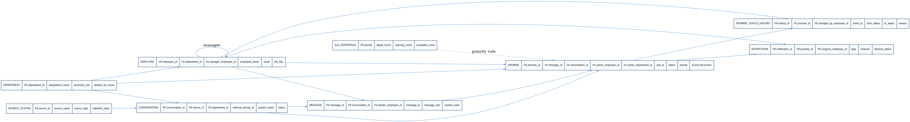
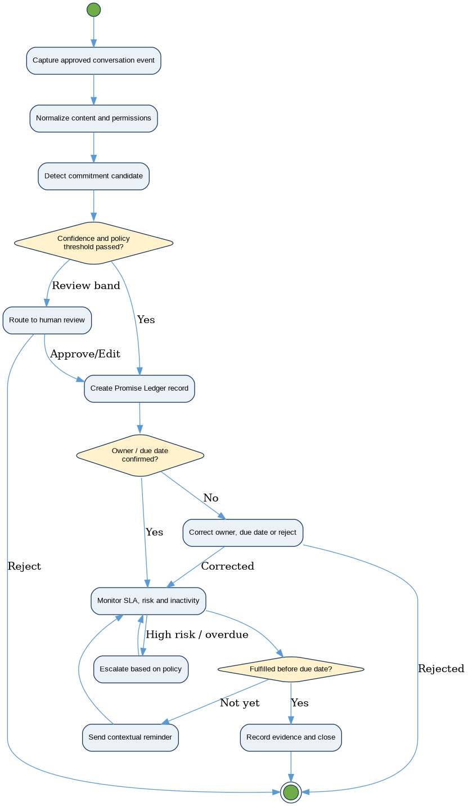
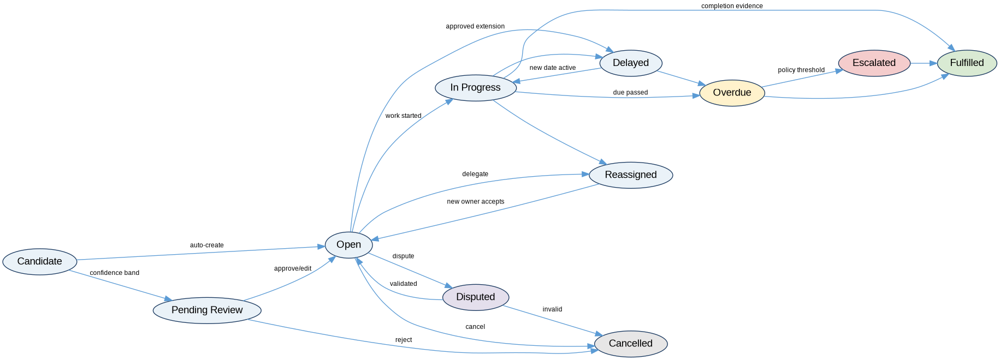

# OpenLoop
## AI-Powered Promise Ledger & Conversation Intelligence Platform

[](docs/PORTFOLIO_CASE_STUDY.md)
[](requirements/OpenLoop_Traceability_and_Project_Control.xlsx)
[](notebooks/openloop_kpi_analysis.ipynb)
[](sql/openloop_sql_library.sql)

**Designed by Akshat Bhagat as an independent Business Analysis and Data Analytics portfolio project.**

OpenLoop is an enterprise SaaS concept that detects commitments, owners, deadlines, follow-ups, and unresolved conversations across workplace systems. It converts conversational obligations into governed **Promise Ledger** records and tracks them through confirmation, reassignment, delay, dispute, escalation, cancellation, or fulfillment.

> **Portfolio integrity:** This repository presents a designed and prototyped enterprise implementation scenario. All operational data is synthetic. Business benefits and ROI are modeled planning assumptions, not realized production results.


## Why This Project Matters

Important commitments are frequently made in Slack, Microsoft Teams, Gmail, meetings, Jira comments, CRM notes, and support tickets before a formal task is created. This creates hidden ownership, inconsistent deadlines, manual status chasing, duplicated follow-up, weak evidence trails, and delayed escalation.

OpenLoop addresses the gap by treating each confirmed commitment as a governed business object rather than an unstructured sentence.

## My Role

I performed the responsibilities of a **Business Analyst, Product Analyst, Data Analyst, and Business Systems Analyst**, including:

- Business case development and ROI modeling
- Stakeholder analysis, RACI, and communication planning
- BRD, FRD, business rules, functional and non-functional requirements
- Epic, feature, user-story, acceptance-criteria, and backlog design
- AS-IS/TO-BE process modeling and gap analysis
- Operational ER model, analytics star schema, metadata, and lineage
- PostgreSQL/SQL Server analytical query design
- KPI governance, dashboard specifications, and reporting design
- AI feature requirements, human-review controls, and model governance
- UAT, regression, performance, security, and accessibility test design
- Roadmap, sprint plan, risk register, RAID log, and release planning

## Project at a Glance

| Area | Deliverable |
|---|---:|
| Business requirements | 18 |
| Functional requirements | 30 |
| Non-functional requirements | 15 |
| User stories | 24 |
| Traceable test cases | 30 |
| SQL queries | 90 |
| Synthetic linked records | 1,168 |
| Pilot population assumption | 3,500 users |
| Modeled Year-1 ROI | 88.8% |
| Modeled payback | 6.4 months |

## Synthetic Data Snapshot

The included reproducible analysis calculates the following results from the 120-promise synthetic sample:

| KPI | Synthetic result |
|---|---:|
| Promise fulfillment rate | 43.3% |
| Overdue/broken promise rate | 19.2% |
| Average resolution time | 128.7 hours |
| Ownership reassignment rate | 10.0% |
| Escalation rate | 4.2% |
| SLA compliance among fulfilled promises | 19.2% |
| Dormant conversation rate | 18.3% |
| Human-confirmed promises | 77.5% |
| Average AI confidence | 86.9% |

These figures demonstrate the analytical workflow; they do not represent a real organization.

## Solution Capabilities

- Approved omnichannel ingestion with source-permission preservation
- AI-assisted promise, owner, deadline, priority, and risk extraction
- Confidence-based automation with human review for uncertain outcomes
- Evidence-linked Promise Ledger lifecycle management
- Owner confirmation, reassignment, delay, dispute, and completion workflows
- Risk-aware reminders, escalation policies, and notification suppression
- Enterprise search and conversation timelines
- Role-based operational and executive dashboards
- Compliance, model-quality, and data-quality reporting
- Immutable audit events, retention controls, and governed exports
- Safeguards against automated employee-performance decisions

## Repository Structure

```text
openloop-promise-ledger/
├── README.md
├── docs/
│   ├── OpenLoop_Enterprise_Case_Study.docx
│   ├── PORTFOLIO_CASE_STUDY.md
│   └── RESUME_INTERVIEW_GUIDE.md
├── data/
│   ├── OpenLoop_Enterprise_Dataset.xlsx
│   └── csv/
├── requirements/
│   └── OpenLoop_Traceability_and_Project_Control.xlsx
├── sql/
│   └── openloop_sql_library.sql
├── notebooks/
│   └── openloop_kpi_analysis.ipynb
├── src/
│   └── openloop_analysis.py
├── dashboard/
│   └── POWER_BI_BUILD_GUIDE.md
├── diagrams/
├── portfolio/
│   └── index.html
└── requirements.txt
```

## Traceability Model

```text
Business Goal
  → Business Requirement
    → Functional / Non-Functional Requirement
      → Epic and User Story
        → Data Object and Business Rule
          → SQL Query and KPI
            → Test Case and UAT Evidence
              → Dashboard / Report
                → Release Gate
```

The traceability workbook demonstrates this chain across requirements, user stories, data objects, tests, KPIs, risks, and delivery controls.

## Data Architecture



The operational model separates conversations, messages, promises, status history, notifications, employees, departments, sources, and SLA reference data. The append-only history table preserves every lifecycle transition.


The analytics layer supports completion, aging, SLA, risk, ownership, source, department, and time-based analysis.

## Process and Lifecycle



A conversational statement moves through source ingestion, AI extraction, confidence and policy checks, owner confirmation, ledger creation, notification, escalation, and closure.



Lifecycle states include Open, In Progress, Reassigned, Overdue, Escalated, Fulfilled, and Cancelled.

## Run the Analysis

```bash
python -m venv .venv
source .venv/bin/activate        # Windows: .venv\Scripts\activate
pip install -r requirements.txt
python src/openloop_analysis.py
```

The script reads the CSV tables, validates key relationships, calculates core KPIs, prints department performance, and exports summary results to `outputs/`.

The same analysis is available as a Jupyter notebook in [`notebooks/openloop_kpi_analysis.ipynb`](notebooks/openloop_kpi_analysis.ipynb).

## Power BI / Tableau

Use [`data/OpenLoop_Enterprise_Dataset.xlsx`](data/OpenLoop_Enterprise_Dataset.xlsx) or the CSV tables and follow the [`Power BI Build Guide`](dashboard/POWER_BI_BUILD_GUIDE.md) to create:

1. Executive Overview
2. Department Performance
3. Promise Operations
4. Risk and SLA

## Modeled Business Case

| Planning assumption | Value |
|---|---:|
| Enterprise workforce | 12,000 employees |
| Initial licensed population | 3,500 users |
| Monthly source volume | ~2.4 million messages/transcript segments |
| Monthly confirmed commitments | ~18,000 |
| Modeled Year-1 cost | $2.15M |
| Modeled Year-1 benefit | $4.06M |
| Modeled Year-1 net benefit | $1.91M |
| Modeled ROI | 88.8% |
| Estimated payback | 6.4 months |

All values require Finance validation through a controlled pilot.

## Key Design Decisions

- Preserve source authorization and do not broaden content visibility through the ledger.
- Separate AI recommendations from deterministic policy and lifecycle state.
- Use confidence bands and human review rather than treating model output as truth.
- Make disputes, corrections, and owner changes first-class auditable events.
- Keep operational current state separate from append-only history and analytical facts.
- Use contextual promise-level and team-level metrics, not a simplistic employee score.
- Measure notification intervention value rather than notification volume.
- Revalidate modeled ROI against pilot adoption and measured time savings.

## Interview Walkthrough

A five-minute walkthrough and resume-ready bullets are included in [`docs/RESUME_INTERVIEW_GUIDE.md`](docs/RESUME_INTERVIEW_GUIDE.md).

## Technology Stack

PostgreSQL · SQL Server · Power BI · Tableau · Excel · Python · Pandas · Jupyter Notebook · Figma · Draw.io · Visio · Jira · Confluence · Azure DevOps · GitHub

## License and Data Notice

Code and documentation are provided under the MIT License. All people, organizations, messages, commitments, metrics, and operating results are fictional or synthetically generated for portfolio and educational use.
