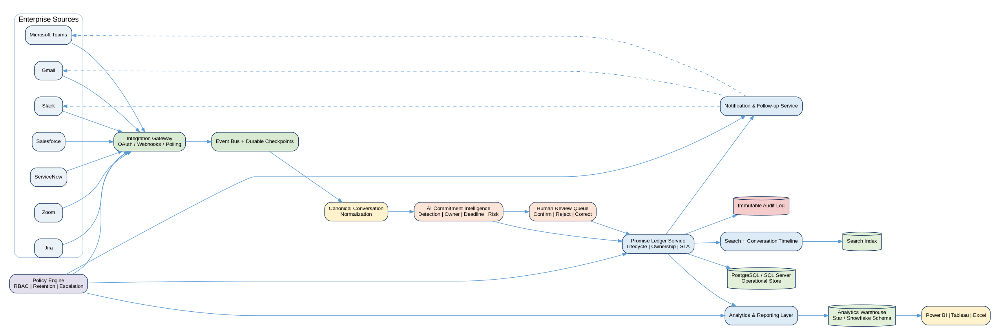
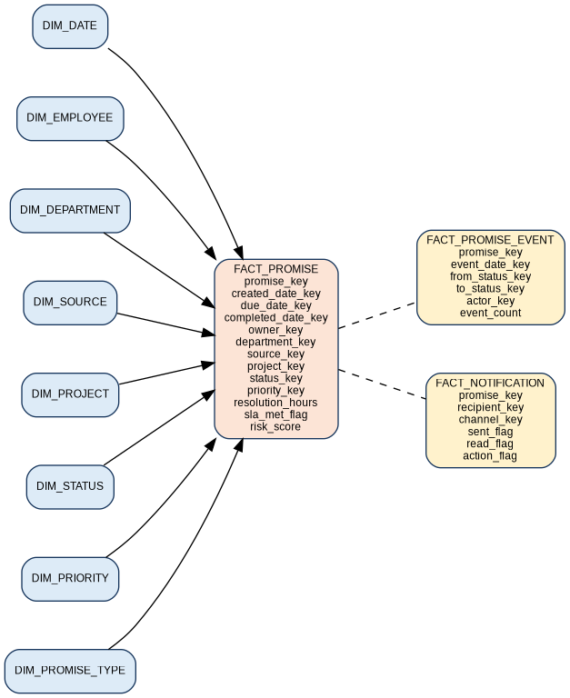

# OpenLoop Portfolio Case Study

## Executive Summary

OpenLoop is an enterprise-grade Promise Ledger and conversation intelligence concept designed to identify, govern, and track commitments made across digital workplace channels. The project demonstrates how an ambiguous operational problem can be translated into business requirements, process models, data architecture, analytics, dashboards, testing, and an implementation roadmap.

## Problem Statement

Organizations rely on Slack, Teams, Gmail, Zoom, Jira, CRM notes, and support tickets for daily execution. Commitments are often expressed conversationally and never become formal tasks. As a result, owners and deadlines remain ambiguous, follow-ups depend on memory, stalled discussions are discovered late, and leaders lack a consistent view of execution risk.

## Proposed Product

OpenLoop detects statements such as “I will send the analysis tomorrow,” extracts the owner and due date, links the record to source evidence, applies confidence and policy rules, and creates a governed Promise Ledger item. The item remains tracked until fulfilled, reassigned, delayed, cancelled, disputed, or escalated.

## Scope

### In Scope
- Approved communication and work-management integrations
- Promise, owner, deadline, priority, and risk extraction
- Human confirmation and correction
- Promise lifecycle and evidence timeline
- Notifications and escalations
- Search, reporting, dashboards, audit, retention, and access control
- AI-model monitoring and data-quality controls

### Out of Scope
- Automatic disciplinary action or employee performance scoring
- Reading channels or messages outside source-system permissions
- Replacing Jira, CRM, or enterprise task-management platforms
- Production deployment to a real organization

## Business Analysis Approach

1. Defined the business problem, current state, target state, measurable goals, and modeled ROI.
2. Identified executive, operational, technical, legal, compliance, HR, and end-user stakeholders.
3. Created a BRD and FRD with business rules, security, performance, audit, accessibility, integration, and API requirements.
4. Converted requirements into epics, features, INVEST-aligned user stories, acceptance criteria, and prioritized backlog items.
5. Modeled AS-IS and TO-BE processes, lifecycle states, decisions, interactions, and system handoffs.
6. Designed the operational database, analytics star schema, metadata, lineage, master data, and reference data.
7. Built a 90-query SQL library and KPI framework.
8. Designed persona-based dashboards, wireframes, scheduled reports, test coverage, and project controls.

## Traceability

The project maintains a full chain from business objective to requirement, user story, data object, KPI, SQL logic, test case, report, and release gate. This prevents requirements from becoming disconnected from implementation and validation.

## Architecture

Approved source events enter through governed integration adapters. A canonical normalization layer feeds an AI extraction service. A deterministic policy engine evaluates confidence, exclusions, permissions, and review rules before a promise is created. Operational storage maintains current state and append-only history, while an analytics warehouse supports certified KPIs and dashboards.

## Data and Analytics

The synthetic data package contains 1,168 linked records, including 120 promises and 304 lifecycle events. The analytical model supports promise completion, aging, SLA, escalation, ownership changes, department performance, source effectiveness, and notification outcomes.

## Sample Analytical Results

| KPI | Result from synthetic data |
|---|---:|
| Fulfillment rate | 43.3% |
| Overdue rate | 19.2% |
| Average resolution time | 128.7 hours |
| Reassignment rate | 10.0% |
| Escalation rate | 4.2% |
| Dormant conversation rate | 18.3% |
| Average AI confidence | 86.9% |

## Product and Governance Decisions

A central design decision was to avoid a simplistic employee accountability score. Commitments can depend on upstream teams, ownership changes, source access, disputed interpretation, and changing business priorities. The proposed dashboards therefore retain evidence and lifecycle context, emphasize team and process signals, and require human review before sensitive decisions.

## Business Case

For a modeled 3,500-user pilot, the planning model estimates $4.06M in Year-1 benefits against $2.15M in Year-1 cost. This represents a potential 88.8% ROI and 6.4-month payback, subject to adoption, extraction quality, notification effectiveness, and validated time savings.

## What This Project Demonstrates

- Requirements elicitation and specification
- Stakeholder and governance design
- Process improvement and systems thinking
- Data modeling and SQL analytics
- KPI definition and dashboard planning
- AI product requirements and responsible-use controls
- UAT, traceability, and delivery management
- Clear communication of complex enterprise solutions
